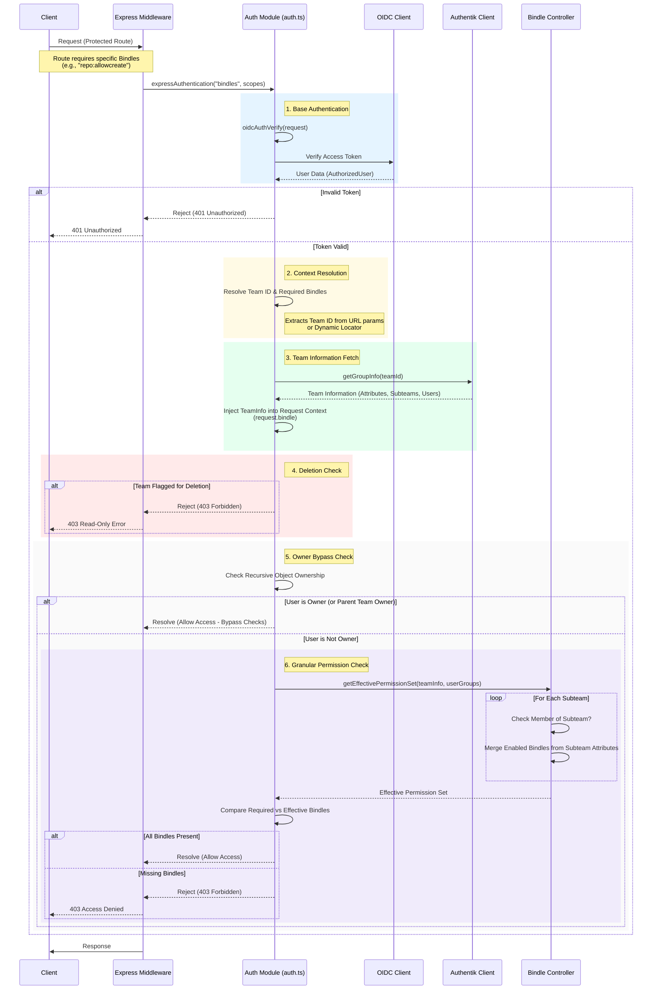

# Bindle Authorization Layer

:::info
This documentation covers the internal workings of the Bindle Authorization Layer. for API usage refer to the [API Reference](https://corp.appdevlcub.com/api/docs).
:::

The Bindle Authorization Layer is the core security mechanism for the People Portal. It enables granular, resource-specific permission management (Bindles) on top of the standard OIDC authentication. It allows teams to manage access to shared resources (like GitHub repositories, Slack channels, etc.) by assigning specific "bindles" to subteams.

## Security Middleware Operation

The Bindle Security Middleware intercepts requests to protected routes. It verifies the user's identity via OIDC, resolves the target team context, and enforces fine-grained permissions.

### Authorization Flow Sequence

The following diagram illustrates the detailed sequence of operations when a request hits a Bindle-protected endpoint.



## Everything Bindles

"Bindles" are the atomic units of permission within the People Portal ecosystem. They represent a specific capability within a shared resource (e.g., `repo:allowcreate` for Gitea, `slack:allowpost` for Slack).

### 1. Bindle Definitions
Bindles are defined by `SharedResourceClient` implementations. Each client (Gitea, Slack, Apple Account, etc.) defines the bindles it supports.

**Structure of a Bindle:**
```ts
export interface BindlePermission {
    friendlyName: string, // Human readable name for UI
    description: string,  // Detailed description of what this permission allows
}
```

**Example: Gitea Client Definitions**
In `src/clients/GiteaClient/index.ts`, the supported bindles are strictly typed and exported:

```ts
private readonly supportedBindles: BindlePermissionMap = {
    "repo:allowcreate": {
        friendlyName: "Allow Repository Creation",
        description: "Enabling this allows members in this subteam to create repositories",
    },
    // ... other bindles
}
```

### 2. Registering Shared Resources
For a Bindle to be recognized by the system, its Client must be registered in the global configuration at `src/config.ts`. This registry allows the `BindleController` to aggregate all available permissions dynamically.

```ts
// src/config.ts
export const ENABLED_SHARED_RESOURCES: { [key: string]: SharedResourceClient } = {
  giteaClient: new GiteaClient(),
  peoplePortalClient: new PeoplePortalClient(),
  // ... other clients
}
```

### 3. Team Attribute Storage
Bindle assignments are stored directly on the Team (or Subteam) objects within Authentik as `attributes`. This allows permissions to persist alongside the group structure.

**Data Layout in Authentik Attributes:**
```json
{
  "bindlePermissions": {
    "GiteaClient": {
      "repo:allowcreate": true,
      "repo:allowsome": false
    },
    "SlackClient": {
      "channel:create": true
    }
  }
}
```

### 4. SharedResourceClient Interface
To implement a new integration that supports Bindles, you must implement the `SharedResourceClient` interface.

```ts
export interface SharedResourceClient {
    // Unique identifier for the client (used as the key in attributes)
    getResourceName(): string
    
    // Returns the map of permissions this client supports
    getSupportedBindles(): BindlePermissionMap

    // Callback to synchronize state when permissions/memberships change
    handleOrgBindleSync(
        org: GetGroupInfoResponse,
        callback: (updatedResourceCount: number, status: string) => void
    ): Promise<boolean>
}
```

### 5. Effective Permission Calculation
The `BindleController.getEffectivePermissionSet` method is responsible for flattening the complex hierarchy of subteams and assignments into a simple set of active permissions for a user.

It performs the following logic:
1.  **Iterates** through all subteams of the target team.
2.  **Checks** if the user is a member of that subteam (O(1) lookup).
3.  **Aggregates** all enabled bindles from the subteams the user is a part of.
4.  **Returns** a Set of strings (e.g., `{"repo:allowcreate", "slack:join"}`).

This "Effective Permission Set" is what the middleware checks against the required scopes.

### 6. Extending the System
To add a new Bindle:
1.  **Choose or Create Client**: Identify the `SharedResourceClient` that manages the resource (or create a new one in `src/clients/`).
2.  **Define Bindle**: Add the new permission key and description to the `supportedBindles` map in the client.
3.  **Implement Logic**: Update the `handleOrgBindleSync` method in your client to actually *enforce* or *sync* this permission to the external service (e.g., calling the Gitea API to add a user to a team with write access).
4.  **Register (if new client)**: Add valid instance to `ENABLED_SHARED_RESOURCES` in `src/config.ts`.
