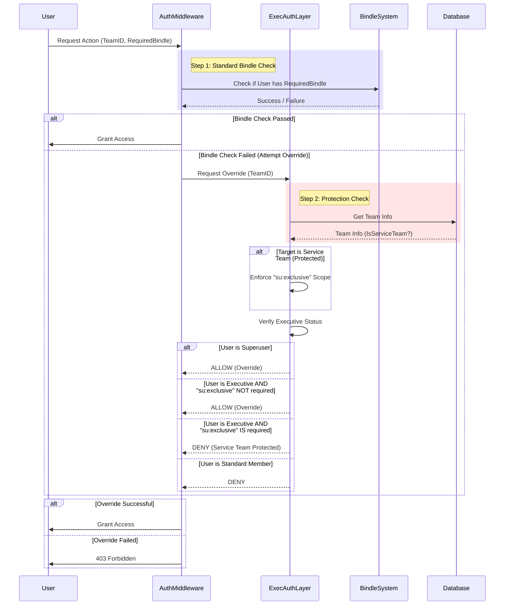

# Executive Authorization Layer

The Executive Authorization Layer is a core authorization system which provides the highest level of resource access and manipulation within People Portal. It overrides all the enforcements from the Bindle Authorization Layer and provides the ability to modify special resources like, Team Creation, Executive Board Manipulation and the ability to create an authoritative team if the user is a Superuser.

:::info
For full API details, please refer to the [API Reference](https://corp.appdevlcub.com/api/docs).
:::

## Overview

In the People Portal, access is typically granted via **Bindles** (e.g., `repo:allowcreate`, `corp:membermgmt`). However, club executives need broad administrative capabilities to manage teams, resolve issues, and oversee operations. Granting every executive every bindle in every team is impractical.

The Executive Authorization Layer solves this by providing **Implicit Administrative Access** to users who are members of the `ExecutiveBoard` team.

## How It Works

The middleware (`executiveAuthVerify`) intercepts authorization requests and evaluates the user's standing.

### The Decision Logic
1.  **Superuser Check**: If the user is a `superuser` (Platform Admin), access is **Always Granted**.
2.  **Scope Check (`su:exclusive`)**: If the requested action requires the `su:exclusive` scope, access is **Denied** for everyone except Superusers.
3.  **Executive Board Check**: If the user is a member of the **Executive Board** (Team Name: `ExecutiveBoard`), access is **Granted**.
4.  **Fallback**: If none of the above match, access is **Denied**.

### Service Team Protection
To prevent Executives from accidentally (or maliciously) modifying critical infrastructure or their own permission sets, the system designates certain teams as **Service Teams** (e.g., `ExecutiveBoard`, `InfraTeam`).

*   **Standard Teams**: Executives *can* override permissions (e.g., managing a Project Team).
*   **Service Teams**: The system automatically enforces the `su:exclusive` scope for override checks. This means Executives **cannot** use their executive privileges to modify Service Teams; they must rely on their explicit bindle permissions or request Superuser intervention.

## Authorization Flow

The following sequence diagram illustrates how the Executive Authorization Layer interacts with the Bindle System and enforces Service Team protections.



## Implementation Details

### The `executiveAuthVerify` Middleware
This function is the core of the layer. It can be used as a standalone TSOA Security middleware or called programmatically.

```typescript
export async function executiveAuthVerify(
    request: express.Request,
    scopes?: string[],
    skipOidcCheck?: boolean
): Promise<boolean> {
    // 1. Superuser Bypass
    if (authorizedUser.is_superuser) return Promise.resolve(true);

    // 2. Superuser Exclusive Lock
    if (scopes && scopes.includes("su:exclusive")) {
        return Promise.reject(new ResourceAccessError(403, "Restricted to Superusers only!"));
    }

    // 3. Executive Board Membership Check
    const userTeams = await authentikClient.getRootTeamsForUsername(authorizedUser.username);
    const isExecutive = userTeams.teams.some(team => 
        team.name === "ExecutiveBoard" && !team.flaggedForDeletion
    );

    if (isExecutive) return Promise.resolve(true);

    return Promise.reject(new ResourceAccessError(403, "Executive Privileges Required"));
}
```

### Bindle Integration
The `bindlesAuthVerify` function integrates this layer to provide the "Override" capability.

```typescript
/* In bindlesAuthVerify */

/* 2.75: Executive Authorization Override */
try {
    /* Service Teams are Restricted to Superusers! */
    const teamScopes = ENABLED_SERVICE_TEAM_NAMES.has(teamInfo.name) 
        ? ["su:exclusive"] 
        : [];
        
    const isExecutive = await executiveAuthVerify(request, teamScopes, true);

    if (isExecutive)
        return Promise.resolve(true);
} catch (e) {
    /* Failed Executive Override, Continue to Standard Checks */
}
```

## Key Configuration

*   **Executive Board Team**: The team identifying executives is hardcoded (configurable via `config.ts`, default `ExecutiveBoard`).
*   **Service Teams**: Defined in `utils/services.ts` and `config.ts`. These teams trigger the `su:exclusive` lock during overrides.
