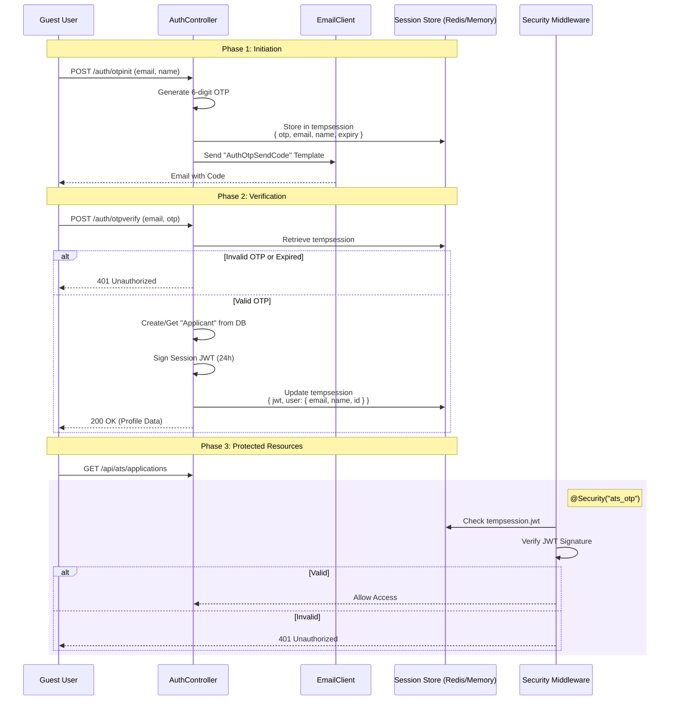

# Guest Authentication

The People Portal provides a specialized authentication mechanism for non-organization members (guests), primarily for the Recruitment/ATS module. This system uses a time-based One-Time Password (OTP) sent via email to establish a temporary, semi-persistent session.

## Architecture & Flow

The Guest Authentication does **not** use OIDC. Instead, it relies on a custom implementation backed by `express-session`, the custom `tempsession` object and signed JWTs.

### Authentication Sequence



## Internal Storage (`tempsession`)

Guest sessions are isolated from the main OIDC `authorizedUser` sessions. They are stored in a dedicated object within the session cookie called `tempsession`.

### Initiation State
During the OTP verification phase (before the user enters the code), the session holds the secret:

```js
req.session.tempsession = {
    otp: "123456",
    otpEmail: "guest@example.com",
    otpName: "John Doe",
    otpExpiry: 1735689600000 // Date.now() + 5 mins
}
```

### Authenticated State
Once verified, the sensitive OTP data is discarded, and the session maps the user to a signed JWT. This JWT acts as the "Bearer" token for the internal API, even though it's stored in the cookie.

```js
req.session.tempsession = {
    jwt: "eyJhbGciOiJIUzI1NiIsIn...", // Signed 24h JWT
    user: {
        email: "guest@example.com",
        name: "John Does",
        id: "60d5ec..." // Mongo Object ID
    }
}
```

## Security Middleware (`ats_otp`)

Endpoints protected by `@Security("ats_otp")` trigger the specific logic in `auth.ts`:

1.  **Existence Check**: Ensures `req.session.tempsession.jwt` exists.
2.  **Verification**: Cryptographically verifies the JWT using `PEOPLEPORTAL_TOKEN_SECRET`.
3.  **Expiry Handling**: If the JWT is expired, the session is cleared, and the user is forced to re-authenticate.

## Applicant Profile

Upon successful verification, if the email does not exist in the `Applicant` database collection, a new profile is automatically created. This "Just-In-Time" provisioning allows guests to immediately start applying for roles without a registration form.
