# OpenID Connect Authentication
## Overview

The application relies on OpenID Connect (OIDC) for user identification and initial authentication. This layer handles the "Who are you?" question before the Bindle layer handles "What can you do?".

:::warning Integration Caveats
While the People Portal relies on standard OpenID Connect for the initial identity handshake (`OpenIdClient`), the internal team management, user provisioning, and Bindle authorization logic are tightly coupled with **Authentik** as the backend store. Therefore, If you choose to swap the Identity Provider, the new provider's client **MUST** implement all interfaces defined in `AuthentikClient`
:::

:::danger Concurrency and Scaling
The Express sessions middleware currently uses an in-memory store. Therefore, OIDC authentication sessions will not span across multiple instances of the application. If a future need arises to horizontally scale, the session store will need to be migrated to a shared store using Redis.
:::

### Required Scopes
:::info
Ensure these scopes are explicitly allowed in your OIDC Provider's configuration (e.g., in Authentik's Provider settings).
:::

To function correctly, the OIDC Provider must support and grant the following scopes upon authorization:

*   `openid`: Standard OIDC requirement.
*   `profile`: To obtain the user's name and nickname.
*   `email`: To link the user to their internal profile.

## Authentication Flow

The following diagram details the interaction between the Client, the People Portal Server, and the OIDC Provider.

```mermaid
sequenceDiagram
    participant User
    participant Server as People Portal Server
    participant Provider as OIDC Provider (Authentik)

    Note over User, Provider: 1. Login Initiation
    User->>Server: GET /api/auth/login
    
    rect rgba(0, 150, 255, 0.1)
        Server->>Server: Generate PKCE Verifier & Challenge
        Server->>Server: Create State & Config
        Server-->>User: Redirect to Provider (302)<br/>(with scope=openid profile email)
    end

    Note over User, Provider: 2. Authentication
    User->>Provider: Authenticate (Username/Password)
    Provider-->>User: Redirect to Callback (302)<br/>(with code & state)

    Note over User, Provider: 3. Session Creation
    User->>Server: GET /api/auth/redirect?code=...
    
    rect rgba(150, 100, 255, 0.1)
        Server->>Provider: Exchange Code for Tokens
        Provider-->>Server: Access Token + ID Token
        Server->>Server: Verify ID Token & Signature
        Server->>Server: Create Express Session<br/>(store accessToken, userProfile)
    end

    Server-->>User: Redirect to App Root (/) (302)
    Note right of User: User is now Authenticated
```

## Integration Interfaces

The OIDC integration acts as the primary gatekeeper for the application.

### Login (`/api/auth/login`)
Initiates the PKCE-enhanced Authorization Code flow. It computes the necessary nonces, state, and code challenges before redirecting the user to the configured `PEOPLEPORTAL_OIDC_DSCVURL`.

### Callback (`/api/auth/redirect`)
Handles the return trip from the provider.
*   **Verifies State**: Ensures the response matches the initiated request.
*   **Code Exchange**: Swaps the authorization code for an `access_token` and `id_token`.
*   **Session Inflation**: Creates an `express-session` containing the `AuthorizedUser` object and the raw `accessToken` for downstream API calls.

### Logout (`/api/auth/logout`)
Destroys the local `express-session` thereby, prevent the user from accessing People Portal resources without renewing the session cookie.

:::tip Non-Standard Behavior
Currently, this does **not** trigger a back-channel logout to the OIDC provider. It only clears the local application session.
:::

### Session Management
The application uses `express-session` backed by a session store (e.g., Redis or Memory). The presence of `req.session.accessToken` and `req.session.authorizedUser` is the canonical check for "Is Authenticated?".
