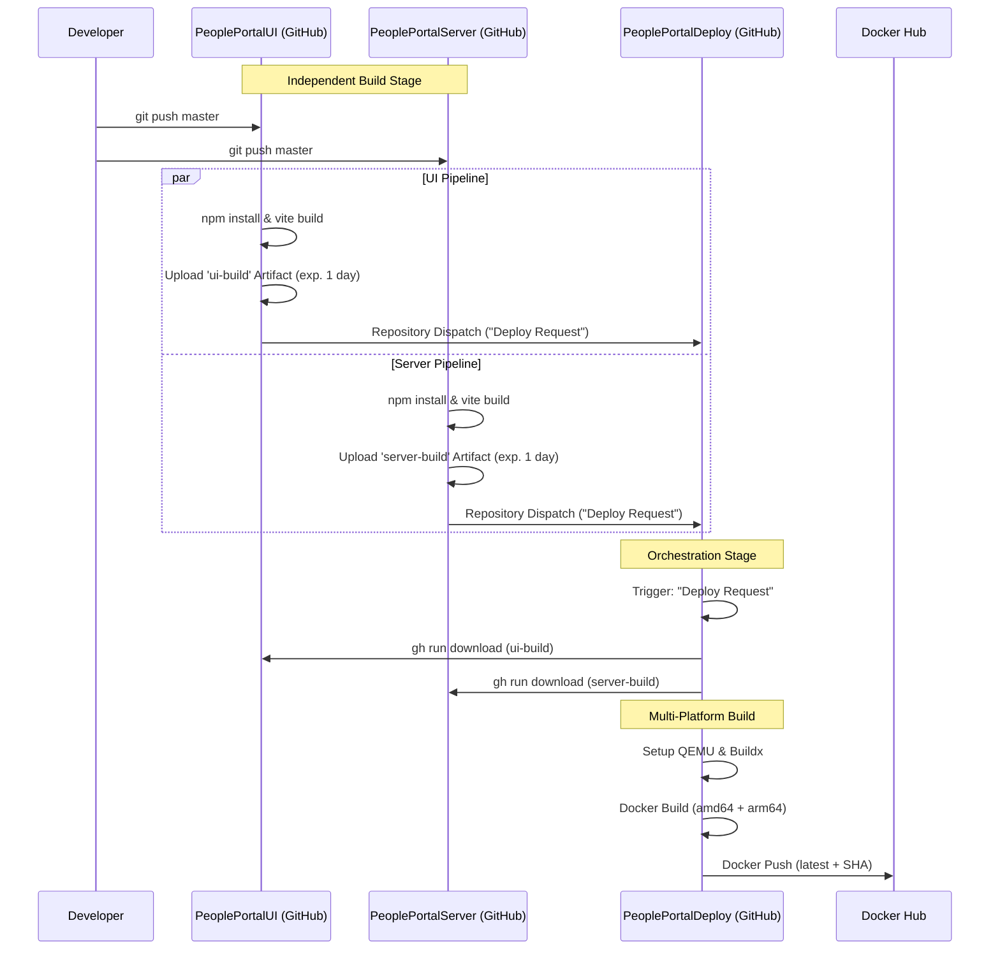

# CI/CD Architecture

This documentation provides a comprehensive guide to the **People Portal** CI/CD architecture. It covers the flow from raw source code in independent repositories to a multi-platform production image hosted on Docker Hub.

People Portal utilizes a **decoupled orchestration** pattern. Instead of one massive repository, the frontend and backend are built independently, and a dedicated deployment repository coordinates the assembly of the final production Docker image.

## Pipeline Architecture

The following sequence diagram illustrates how a code push to either the Frontend or Backend repository triggers the global deployment flow.



## Security & Authentication

We use **Repository Secrets** instead of Environment Secrets to ensure the workflow has global access to the necessary tokens without the overhead of environment-specific protection rules or manual approval gates.

### Fine-grained Personal Access Token (PAT)

:::warning Token Scope
The **Repository selection** for this token must include `PeoplePortalUI`, `PeoplePortalServer` and`PeoplePortalDeploy`
:::

To allow the UI and Server repositories to "ping" the Deploy repository and for the Deploy repository to download artifacts from other private repos, you must create a Fine-grained PAT with the following scope:

| Permission | Level | Reason |
| --- | --- | --- |
| **Contents** | `Read & Write` | Required to trigger Repository Dispatch events and read code. |
| **Actions** | `Read & Write` | Required to download artifacts across repositories via GitHub CLI. |
| **Metadata** | `Read-only` | Mandatory default permission. |

### Secret Configuration
:::tip Secrets Location
Secrets must be added under **Settings > Secrets and variables > Actions > Repository secrets**. Do **not** create a new environment.
:::

**In `PeoplePortalUI` & `PeoplePortalServer`:**

* `PEOPLEPORTAL_DEPLOY_TOKEN`: The Fine-grained PAT.

**In `PeoplePortalDeploy`:**

* `PEOPLEPORTAL_DEPLOY_TOKEN`: The same Fine-grained PAT.
* `DOCKERHUB_USERNAME`: Your Docker Hub account username.
* `DOCKERHUB_TOKEN`: A Docker Hub Access Token (generated in Docker Hub account settings).

## Independent Build Repositories

Both the [PeoplePortalUI](https://github.com/candiedoperation/PeoplePortalUI) and [PeoplePortalServer](https://github.com/candiedoperation/PeoplePortalServer) repositories function as independent build units.

### Build & Artifact Upload

The code is built using Node 23. The compiled `dist` folder and package manifests are uploaded as a GitHub artifact.

```yaml
      - name: Upload Server Artifact
        uses: actions/upload-artifact@v4
        with:
          name: server-build # Or ui-build for the UI repo
          path: |
            dist/
            package*.json
          retention-days: 1

```

:::info Artifact Retention
We set `retention-days: 1`. This reduces storage costs and security surface area, as these artifacts are ephemeral "handoff" files only needed long enough for the Deploy repo to ingest them.
:::

### Notify Deploy (Repository Dispatch)

Once the artifact is safe on GitHub's servers, the workflow "pings" the deployment repository. We use the custom event types `People Portal UI Deploy Request` and `People Portal Server Deploy Request`. The following is a trigger example from the server's workflow:

```bash
curl -L \
  -X POST \
  -H "Accept: application/vnd.github+json" \
  -H "Authorization: Bearer ${{ secrets.PEOPLEPORTAL_DEPLOY_TOKEN }}" \
  -H "X-GitHub-Api-Version: 2022-11-28" \
  [https://api.github.com/repos/candiedoperation/PeoplePortalDeploy/dispatches](https://api.github.com/repos/candiedoperation/PeoplePortalDeploy/dispatches) \
  -d '{"event_type": "People Portal UI Deploy Request", "client_payload": {"repo": "server", "sha": "${{ github.sha }}"}}'

```

## The Orchestrator (`PeoplePortalDeploy`)

The [PeoplePortalDeploy](https://github.com/candiedoperation/PeoplePortalDeploy) repo coordinates the assembly of the final product.

### Concurrency & Debouncing

Since a push to the UI and a push to the Server might happen simultaneously, we use a concurrency group. This "debounces" the deployment by cancelling any older build that is still in progress when a new one arrives.

```yaml
concurrency:
  group: deploy-orchestration
  cancel-in-progress: true 

```

### Multi-Platform Support (amd64/arm64)

To ensure the image runs on standard cloud servers (Intel/AMD) as well as modern developer machines (Mac M1/M2/M3), we build for two platforms simultaneously using QEMU emulation.

```yaml
      - name: Set up QEMU
        uses: docker/setup-qemu-action@v3
      - name: Set up Docker Buildx
        uses: docker/setup-buildx-action@v3
      # ...
      - name: Build and Push
        uses: docker/build-push-action@v5
        with:
          platforms: linux/amd64,linux/arm64
          push: true
          tags: |
            candiedoperation/people-portal:latest
            candiedoperation/people-portal:${{ github.event.client_payload.sha || github.sha }}

```

### Dockerfile Logic & Optimization

The Dockerfile is structured to create a production-ready environment by nesting the UI directly inside the Server's distribution folder.

1. **Assembly:** It downloads the `server-build` and `ui-build` artifacts.
2. **Nesting:** It creates a `dist/ui` folder inside the server root and copies the frontend there.
3. **Internal Install:** It runs `npm install --omit=dev` inside the Alpine Linux container.

:::tip Native Binaries
By running `npm install` inside the container rather than copying `node_modules` from the GitHub runner, we ensure that native binaries (like database drivers) are compiled specifically for the target Linux OS, preventing "wrong architecture" errors.
:::

## Final Deployment

The final multi-platform image is published to 
**[Docker Hub](https://hub.docker.com/r/candiedoperation/people-portal)**

### Tagging Strategy

* `latest`: Points to the most recent successful build from either repo's `master` branch.
* `{SHA}`: The specific commit hash from the triggering repository, allowing for granular version tracking and rollbacks.

### Environment Variables

For a detailed list of variables required to run the final container (database strings, API keys, etc.), please refer to the [Environment Variables Guide](https://wiki.appdevclub.com/people-portal-dev-guide/deployment/environment-variables).

To run the full stack locally, configure the environment variables and run:

```bash
docker pull candiedoperation/people-portal:latest
docker run -p 3000:3000 candiedoperation/people-portal:latest

```