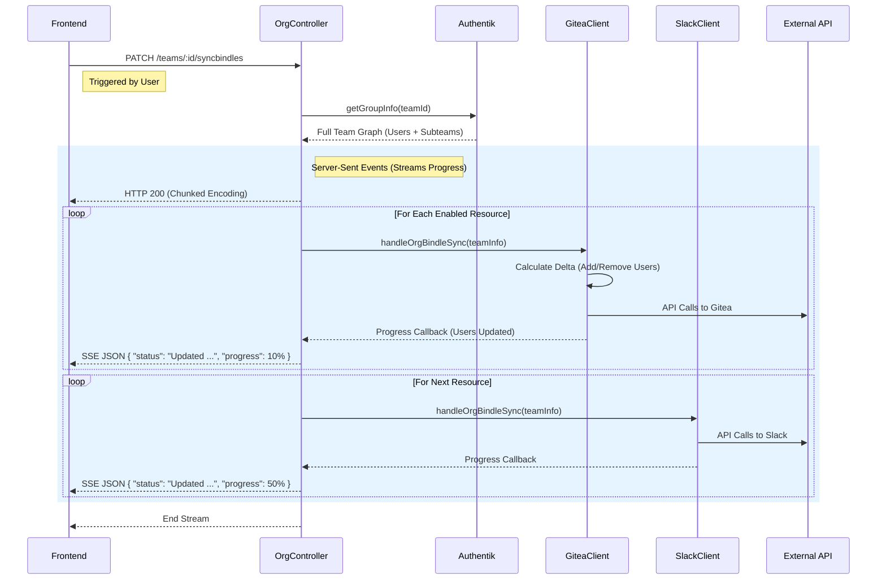

# Shared Resources Architecture

"Shared Resources" are external tools and platforms (like Gitea, Slack, Apple Developer Account, etc.) that the People Portal manages access to. The system acts as a centralized bridge, translating internal team memberships and Bindle permissions into concrete access controls on these downstream services.

## Architecture Overview

The core of the system relies on the `SharedResourceClient` interface. Each external service is implemented as a client that knows how to:
1.  Define its own capabilities (Bindles).
2.  Take an internal Team definition and "sync" it to the external service.

### The Sync Loop (`syncOrgBindles`)

Synchronization is **not fully real-time**. Instead, it is an on-demand process triggered by team owners or administrators via the headers of the Team Dashboard. When triggered, the `OrgController.syncOrgBindles` method orchestrates the update.



## Configuring Shared Resources
:::warning Shared Resources ID
Every team provided to handleOrgBindleSync() and the subteam information within it contains a Team Name field (`teamInfo.name`). We call this name a **Shared Resource ID** which is guarenteed to be human readable and unique. Therefore, any standard addition transformation to a Shared Resource ID will also be unique and can be used as names and IDs in the external resource.
:::

### The Interface
All shared resources must implement the `SharedResourceClient` interface found in `src/clients/index.ts`.

```ts
export interface SharedResourceClient {
    // Unique identifier for the client
    getResourceName(): string
    
    // Defines what permissions this resource supports
    getSupportedBindles(): BindlePermissionMap

    // The Core Logic: Syncs the internal team state to the external resource
    handleOrgBindleSync(
        org: GetGroupInfoResponse,
        callback: (updatedResourceCount: number, status: string) => void
    ): Promise<boolean>
}
```

### Enabling a Resource
Resources are registered in `src/config.ts`. The `OrgController` iterates over this registry to discover available resources.

```ts
// src/config.ts
export const ENABLED_SHARED_RESOURCES: { [key: string]: SharedResourceClient } = {
  giteaClient: new GiteaClient(),
  slackClient: new SlackClient(),
  // Add new clients here
}
```

## Deep Dive: Gitea Implementation

The `GiteaClient` (`src/clients/GiteaClient/index.ts`) serves as a reference implementation for complex resource management.

### Mapping Internal to External
*   **Organization**: Maps the Root Team (e.g., "Project Nebula") to a Gitea Organization.
*   **Teams**: Maps internal Subteams (e.g., "Engineering", "Leadership") to Gitea Teams within that Organization.
*   **Permissions**: Maps Bindle permissions (like `repo:allowcreate`) to Gitea specific units (e.g., "Write Access", "Issue Tracker").

### Delta Calculation
To avoid rate limits and improve performance, clients typically calculate a "Delta" rather than blindly updating everyone.

```ts
/* Logic from GiteaClient */
const finalStateUsernames = team.users.map(u => u.username);
const currentStateUsernames = await this.getTeamMembers(externalTeamId);

const { additions, deletions } = computeStringArrStateDiff(
    finalStateUsernames, 
    currentStateUsernames
);

// Only API calls for additions and deletions are made
```

## Adding a New Resource

1.  **Create Client**: Create a new directory in `src/clients/` (e.g., `DiscordClient`).
2.  **Implement Interface**: specific the `SharedResourceClient` methods.
3.  **Define Bindles**: Decide what permissions you want to expose (e.g., `discord:managechannels`).
4.  **Register**: Add to `ENABLED_SHARED_RESOURCES` in `src/config.ts`.
5.  **Restart**: The server will automatically pick up the new resource, allow teams to configure it in their settings, and include it in the Sync Loop.
