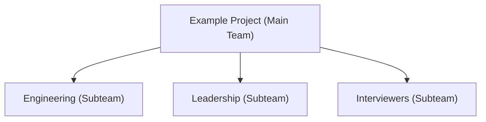

# Understanding Teams

The People Portal uses a structured approach to organization, allowing you to manage teams through a hierarchy of **Main Teams** and smaller **Subteams**.

This view in **Organization > Teams** shows a list of all the Project Teams you are currently a member of. If you are looking for a team you haven't joined yet, you can click the link below the list to view every team across all of App Dev.

## The Main Team

The Main Team is the primary container for your Project Team. It holds the high-level information that applies to every member and every activity within your Project Team.

When you create a Project Team in People Portal, you set the core details of your Main Team:
- **Season**: The specific timeframe the team is active (e.g., Fall 2025).
- **Shared Resource ID**: A unique "short name" used to connect your team to services like App Dev Git.
- **Recruitment**: All hiring details, such as the roles you are looking for and the applications you receive, are managed directly under the Main Team. 

## Subteams (Working Groups)

Subteams are smaller, specialized groups inside your Main Team. They help you divide members into functional units based on their specific tasks (e.g., "Frontend," "Design," or "Marketing"). 

By default, when a Project Team is created, the **Leadership Subteam** and **Engineering Subteam** are automatically created.

### Example Layout
A typical team might look like this:

## Why this structure?

- **Simple Permissions**: If you add a lead to the **Main Team**, you can easily grant them access to all  subteams at once.
- **Better Organization**: Instead of having every member in one giant list, subteams keep your workspace organized by project tasks.

